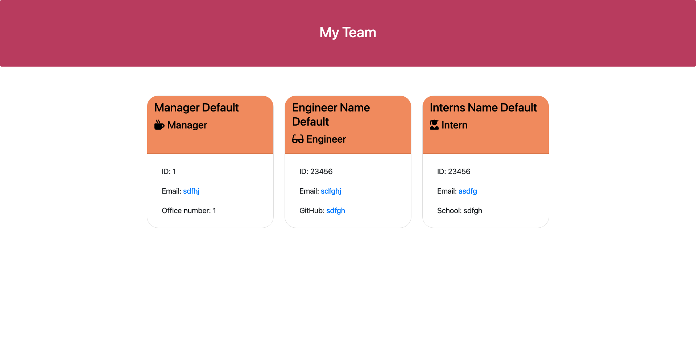

  # Team Profile Generator
      
  ## Description
      
  The motivation for this project was to be able to create a webpage quickly and efficiently!
  This project was built to help me understand how classes can be used in a real worlr scenario, it also anables a Manager to add his or her employees details and quickly have a website built with their details.
  This project solves the problem if building a website and for a Manager who has any number of employees under him!
  I learnt how to use synchronus file writing and js classes. I was able to also exted my knowlage of the inquirer node module package.
      
  ## Table of Contents
      
  If your README is long, add a table of contents to make it easy for users to find what they need.
      
  - [Installation](#installation)
  - [Usage](#usage)
  - [Credits](#credits)
  - [License](#license)
      
  ## Installation
      
  `git pull` to a local repo
      
      
  ## Usage
      
  run `node index.js` from the root folder and answer the questions when finished adding the employees you the app will automatically generate the html.
      
      
  To add a screenshot, create an "assets/images" folder in your repository and upload your screenshot to it. Then, using the relative filepath, add it to your README using the following syntax:
  ##      
  ## Credits
      
  List your collaborators, if any, with links to their GitHub profiles.
      
  If you used any third-party assets that require attribution, list the creators with links to their primary web presence in this section.
      
  If you followed tutorials, include links to those here as well.
      
  ## License
      
  MIT License
      
      
  ---
      
  🏆 The previous sections are the bare minimum, and your project will ultimately determine the content of this document. You might also want to consider adding the following sections.
      
  
      
  ## Languages 
  ###### Javascript 
  ###### HTML 
  ###### CSS
      
  ## Features
    
      
  ## Tests
      jest
